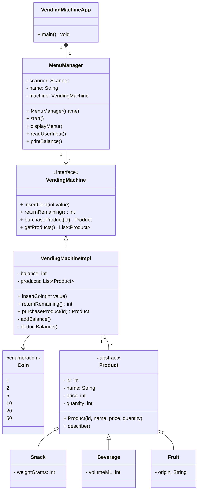

# Class diagram for Vending Machine

```mermaid
classDiagram
    class VendingMachineApp {
        + main() void
    }
    
    class MenuManager {
        - scanner: Scanner
        - name: String
        - machine: VendingMachine
        + MenuManager(name)
        + start()
        + displayMenu()
        + readUserInput()
        + printBalance()
    }
    
    class VendingMachine{
        <<interface>>
        + insertCoin(int value)
        + returnRemaining() int
        + purchaseProduct(id) Product
        + getProducts() List~Product~
    }
    
    class VendingMachineImpl{
        - balance: int
        - products: List~Product~
        + insertCoin(int value)
        + returnRemaining() int
        + purchaseProduct(id) Product
        - addBalance()
        - deductBalance()
    }

    class Coin {
        <<enumeration>>
        1
        2
        5
        10
        20
        50
    }

    class Product {
        <<abstract>>
        - id: int
        - name: String
        - price: int
        - quantity: int
        + Product(id, name, price, quantity)
        + describe()
    }
    
    class Snack {
        - weightGrams: int
    }

    class Beverage {
        - volumeML: int
    }

    class Fruit {
        - origin: String
    }

    VendingMachineApp "1" *-- "1" MenuManager
    MenuManager "1" --> "1" VendingMachine
    VendingMachine <|.. VendingMachineImpl
    VendingMachineImpl "1" o-- "*" Product
    VendingMachineImpl --> Coin
    Product <|-- Snack
    Product <|-- Beverage
    Product <|-- Fruit
```